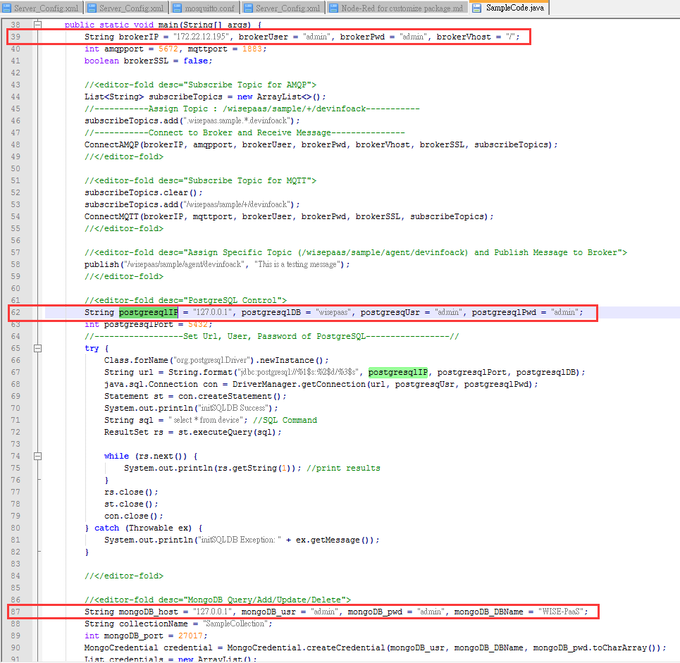
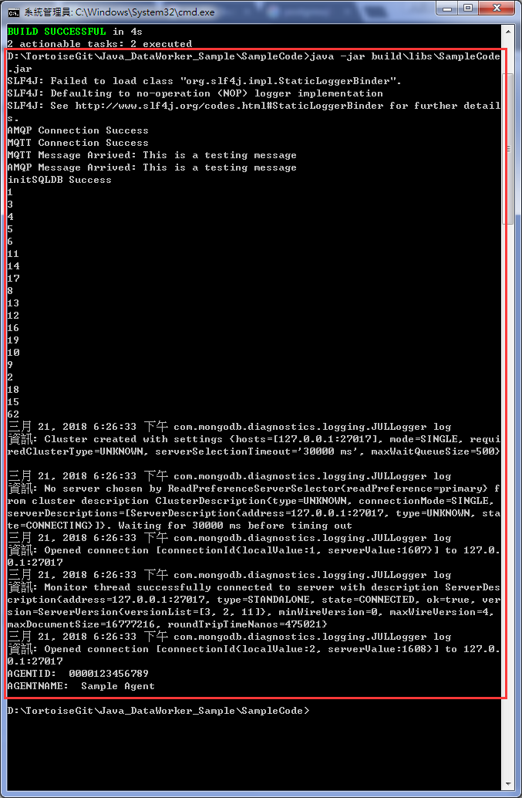

Java_DataWorker_Sample
===

**Enviroment**
---

- [JRE](https://java.com) : 8_121
- [PostgreSQL](https://www.postgresql.org/) : 9.6
- [MongoDB](https://www.mongodb.com) : 3.2
- [RabbitMQ](https://www.rabbitmq.com/) : 3.6.6
    
**Developers**
---

- Clone the code and navigate to `./Java_DataWorker_Sample/SampleCode` folder

    ```sh
    cd ./Java_DataWorker_Sample/SampleCode
    ```

- Open `SampleCode.java` under `./Java_DataWorker_Sample/SampleCode/src/main/java` and modify some codes about **username** and **password**
    

- Run **gradle** command to build jar file

    ```sh
    gradlew runnableJar
    ```

- **Lunch Java_DataWorker_Sample via command on your PC**

    ```sh
    java -jar ./Java_DataWorker_Sample/SampleCode/build/libs/SampleCode.jar
    ```
    
**Cloud Foundry**
---

- Prerequisites
    - [CF Command](https://docs.cloudfoundry.org/cf-cli/install-go-cli.html)
    - Check the buildpack `java_buildpack_offline` exists in cf buildpacks list.
    - Check `rabbitmq`, `postgrsql` and `mongodb` service instance are in cf services.
    
- Create manifest.yml file

    ```sh
    gradlew makeManifest
    ```

- Push Application to PCF

    ```sh
    cf push -f manifest.yml
    ```

**Test data**
---


    